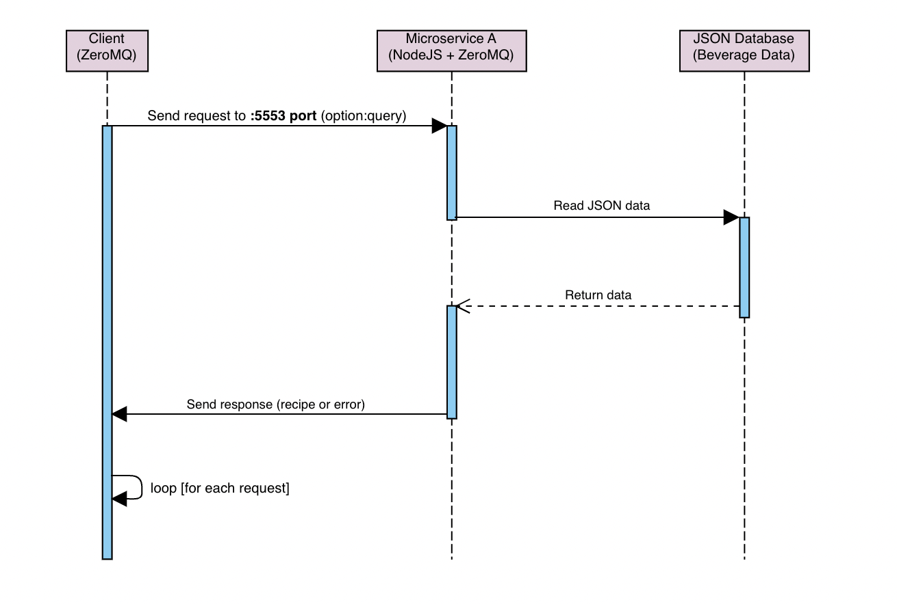

# Beverage Recipe Search Service
S2.6 - Assignment 8: Microservice A for searching/filtering beverages

This is a small microservice for searching and filtering drink recipes. It is built using Node.js and ZeroMQ.

## Installation
1. Install NodeJS
2. Clone the repository and navigate to the project folder
3. Run the following command to install dependencies:
```
    npm install
```
4. Copy `.env.example` to `.env`:
```
    cp .env.example .env
```
5. Open `.env` and set your values:
   - `TCP_PORT`: The TCP port for ZeroMQ (e.g., 5553)
   - `JSON_PATH`: The absolute path to the JSON file containing all drink recipes

## How to Request/Receive Data
To request data from the microservice, you need to send a request using ZeroMQ.

Once the request is sent, the microservice will process it and send back a response.
If the drink is found, the service will return the recipe as a string.
If no data is found, it will return an error message.

### Request Format
The request message format is:
```
<option>:<query>
```
- Option 1 - Search by drink name
- Option 2 - Search by category
- Option 3 - Search by ingredients

### Example Request and Response
```javascript
// Example: Search by name
const zmq = require("zeromq");
const sock = new zmq.Request();

sock.connect("tcp://localhost:5553");

async function requestData(option, userInput) {
  // Example request
  await sock.send(`${option}:${userInput}`);
  
  // Example response
  const [response] = await sock.receive();
  console.log("Response:", response.toString());
}

requestData(1, "Mojito");
```

## UML sequence diagram
